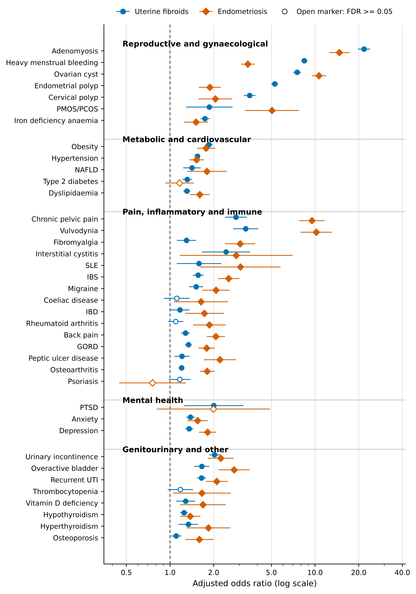

# Shared Genetic Architecture and Temporal Comorbidity Patterns in Uterine Fibroids and Endometriosis



## Overview

This repository contains the analysis scripts and key results for a multi-layer genomic study of the shared and distinct architecture of uterine fibroids and endometriosis using UK Biobank data. Eight analytical layers are integrated:

1. **Comorbidity epidemiology** — odds ratios across 46 traits (logistic regression, N = 221,143)
2. **Temporal ordering** — HES ICD-10 date-based sequencing of disease onset with exact binomial tests and same-day sensitivity analysis
3. **Genetic correlation** — LDSC (genome-wide) + LAVA (2,495 local genomic blocks)
4. **Mendelian randomisation** — bidirectional MR + PheWAS-MR (22 outcomes × 2 exposures)
5. **Gene-level analysis** — MAGMA v1.10, SNPwise-mean, 1000G EUR LD reference
6. **Olink proteomics** — Explore 3072 panel (UK Biobank)
7. **Proteome-MR** — causal inference from protein levels to comorbidity outcomes
8. **Colocalization** — Bayesian colocalization (coloc) of pQTL and GWAS signals
9. **Single-cell context** — scRNA-seq validation of shared MAGMA hub genes in specific cell types (Stroma## Key findings

- **Local genetic correlation (LAVA)**: Genome-wide LAVA analysis across 2,495 LD-based genomic blocks produced 92 blocks with valid p-values, of which **16** were FDR-significant. Top hubs include **ESR1**, **WNT4**, and **WT1**. Three loci showed antagonistic effects (negative local $r_g$) on the X chromosome.
- **Colocalisation (SuSiE multi-signal bounds)**: 53 loci were upgraded in classification, but none exceeded PP.H4=0.80. This indicates limited evidence for exact shared causal variants at identical single signals, despite the strong local genetic correlation.
- **Mendelian randomisation**: Expanded PheWAS MR identified a robust causal effect from Endometriosis $\rightarrow$ Irritable Bowel Syndrome (IBS) (IVW OR=1.075, P=0.006, Egger intercept P=0.131). Uterine Fibroids $\rightarrow$ IBS was null.
- **Single-cell & Tissue Enrichment**: Integration with FUMA MAGMA and scEndoExplorer scRNA-seq confirmed distinct tissue contexts (Endometrial stromal/epithelial vs. Myometrial smooth muscle).
- **Temporal Ordering**: Exact temporal tests showed post-diagnosis enrichment for most informative comorbidities (13/19 for fibroids, 12/19 for endometriosis).
- **Proteome-MR**: TFPI $\rightarrow$ Hypertension (Tier 3, OR = 0.75, FDR = 0.008).

## Data availability

This study uses data from:

- **UK Biobank** — Application #[NUMBER]. Access via https://www.ukbiobank.ac.uk
- **FinnGen R9** — https://finngen.gitbook.io/documentation
- **GWAS summary statistics** — Gallagher et al. 2019 (*Nat Commun* 10:4473); Rahmioglu et al. 2023 (*Nat Genet* 55:423–436)
- **1000 Genomes EUR reference** — https://ftp.1000genomes.ebi.ac.uk
- **scRNA-seq datasets** — Fibroids (GEO: GSE162122) and Endometriosis (GEO: GSE203191)

Summary statistics and intermediate files are too large for this repository and are provided as Supplementary Data alongside the manuscript.

## Repository structure

```
scripts/
  01_comorbidity/         Logistic regression ORs, temporal HES analysis
  02_genetic_correlation/ LDSC genome-wide rg, LAVA local rg (R & Python robust methods)
  03_mendelian_randomisation/ Primary MR, PheWAS-MR robust extension (Python)
  04_gene_level/          MAGMA v1.10 pipeline, FUMA tissue enrichment
  05_proteomics/          pQTL extraction, coloc, proteome-MR
  06_figure_generation/   Python scripts for publication figures (Volcano, Manhattan, Radial Map)
  07_single_cell_context/ scRNA-seq cell-type validation mapping
  08_eqtl_coloc/          Bayesian colocalisation of GWAS and GTEx eQTL signals

figures/
  (Generated figures will output here)

results/
  (Result CSVs will be generated here upon running the scripts)

environment/
  requirements.txt        Python dependencies
  R_packages.txt          R package versions
```

## How to reproduce

**Prerequisites:** R ≥ 4.2, Python ≥ 3.10, MAGMA v1.10 binary (see `scripts/04_gene_level/README_MAGMA_SETUP.txt`)

Run in order:
```bash
# 1. Comorbidity analysis (R & Python)
Rscript scripts/01_comorbidity/precompute_results.R
Rscript scripts/01_comorbidity/run_temporal_analysis.R
python scripts/01_comorbidity/run_temporal_statistical_tests.py

# 2. Genetic correlation (R & Python)
Rscript scripts/02_genetic_correlation/Run_LDSC_Models.R
python scripts/02_genetic_correlation/lava_coloc_robust.py

# 3. Mendelian randomisation (R & Python)
Rscript scripts/03_mendelian_randomisation/PheWAS_MR_46traits.R
python scripts/03_mendelian_randomisation/phewas_mr_robust.py

# 4. Gene-level & Tissue Enrichment (MAGMA)
bash scripts/04_gene_level/run_tissue_enrichment.sh
python scripts/04_gene_level/plot_tissue_enrichment.py

# 5. Proteomics (R)
Rscript scripts/05_proteomics/01b_pQTL_instruments_local.R
Rscript scripts/05_proteomics/02b_coloc_local.R
Rscript scripts/05_proteomics/03b_proteome_MR_local.R
Rscript scripts/05_proteomics/04_pMR_coloc_visualization.R

# 6. eQTL Colocalization (Python)
python scripts/08_eqtl_coloc/colocalize_gwas_eqtl.py

# 7. Figures (Python & R)
python scripts/06_figure_generation/generate_publication_plots.py
python scripts/06_figure_generation/generate_global_hub_map.py
python scripts/06_figure_generation/generate_temporal_figure.py
python scripts/06_figure_generation/generate_headtohead_forest.py
Rscript scripts/03_mendelian_randomisation/generate_phewas_summary_forest.R
python scripts/06_figure_generation/generate_workflow_diagram.py

# 8. Single-cell context (R & Python)
# IMPORTANT: Before running, manually download the raw single-cell datasets 
# for Fibroids (GEO: GSE162122) and Endometriosis (GEO: GSE203191) from NCBI GEO.
Rscript scripts/07_single_cell_context/gse162122_fibroid_scrna_shared_gene_context.R
python scripts/07_single_cell_context/generate_scrna_celltype_validation_tables.py
python scripts/07_single_cell_context/plot_scrna_shared_gene_context.py

```

## Software

| Tool | Version | Reference |
|---|---|---|
| MAGMA | v1.10 | de Leeuw et al. *PLoS Comput Biol* 2015 |
| TwoSampleMR | ≥ 0.5.7 | Hemani et al. *eLife* 2018 |
| coloc | ≥ 5.1 | Giambartolomei et al. *PLoS Genet* 2014 |
| LAVA | ≥ 1.0 | Ning et al. *Nat Genet* 2021 |
| LDSC | ≥ 1.0 | Bulik-Sullivan et al. *Nat Genet* 2015 |
| Python | 3.10+ | pandas, numpy, matplotlib, scipy |
| R | 4.2+ | see environment/R_packages.txt |

## Citation

> Modhukur V et al. Shared Genetic Architecture and Temporal Comorbidity Patterns in Uterine Fibroids and Endometriosis. *Manuscript in preparation* (2026).

## Correspondence

Vijayachitra Modhukur — vijayachitra.modhukur@celvia.ee  
Institute of Biotechnology, University of Tartu, Estonia | Celvia CC, Tartu, Estonia
